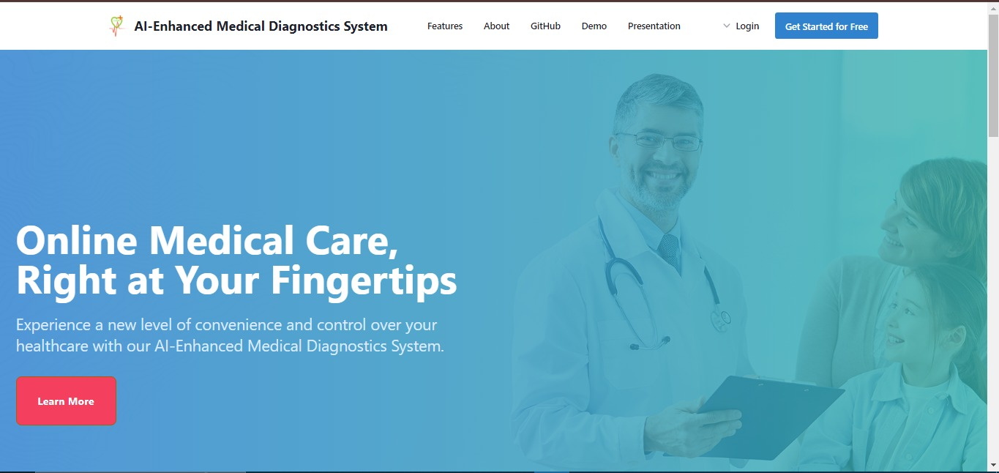
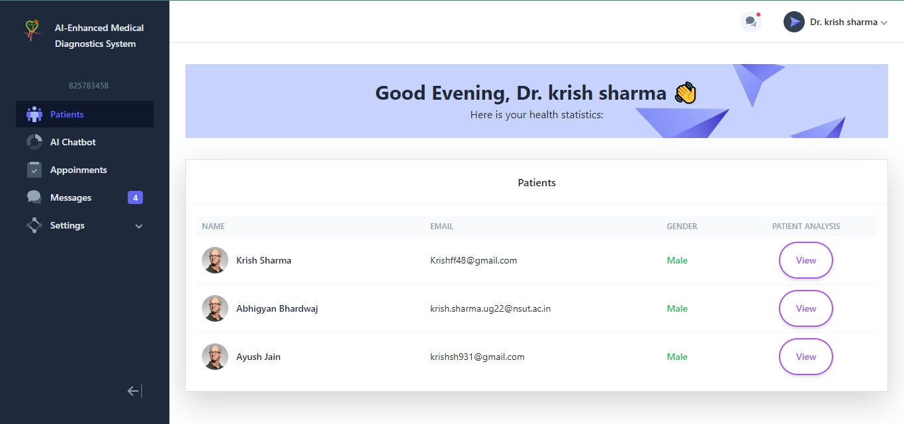
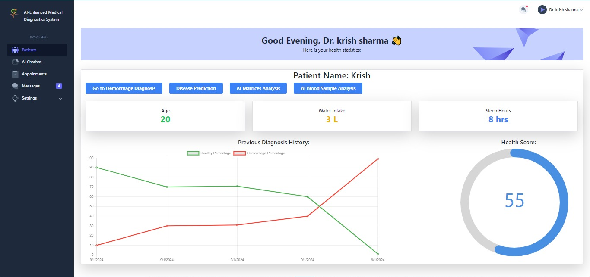
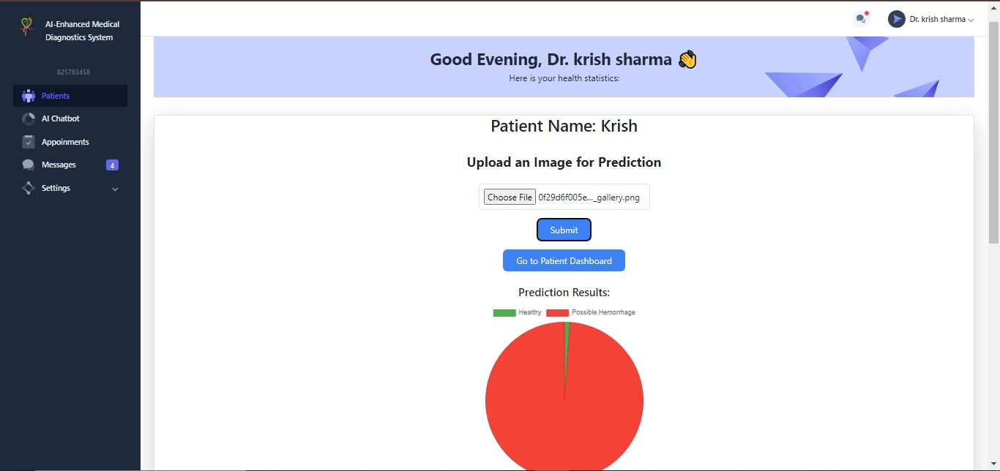

# AI-Enhanced Healthcare Diagnostics and Management System inspired by ZK Medical Billing Platform

This README provides an overview of the project, including team details, relevant links, tasks completed, tech stack, key features, and steps to run the project locally.

## Team Details

*Team Name:* RISE

*Team Leader:* [@LeoAB03](https://github.com/LeoAB03)

*Team Members:*

- *Abhigyan Bhardwaj* - 2022UMV7630 - [@LeoAB03](https://github.com/LeoAB03)
- *Ayush Kumar* - 2022UMV7644 - [@ak35Ayush](https://github.com/ak35Ayush)
- *Ayush Jain* - 2022UEA6548 - [@ayush14189](https://github.com/ayush14189)
- *Aishwina Nainwal* - 2023UEC2605 - [@AishwinaNainwal](https://github.com/AishwinaNainwal)
- *Krish Sharma* - 2022UEA6506 - [@Krishsh93](https://github.com/Krishsh93)
- *Ankit Sneh* - 2022UEA7618 - [@ENDOMINOUSANK](https://github.com/ENDOMINOUSANK)

## Project Links

- *Internal Presentation:* [Internal Presentation](https://github.com/LeoAB03/SIH_INTERNAL_ROUND_1_RISE/blob/main/files/Internal_PPT_RISE.pdf)
- *Final SIH Presentation:* [Final SIH Presentation](https://github.com/LeoAB03/SIH_INTERNAL_ROUND_1_RISE/blob/main/files/SIH_PPT_RISE.pdf)
- *Video Demonstration:* [Watch Video](https://youtu.be/1hkT1awinJo?si=4tuUg5z-b6qb2pr4)
- *Live Deployment:* [View Deployment](DEPLOYED LINK IF ANY)
- *Source Code:* [GitHub Repository](https://github.com/LeoAB03/SIH_INTERNAL_ROUND_1_RISE)
- *Additional Resources:* [Other Relevant Links](https://github.com/Krishsh93/healthcare)

# AI-Enhanced Medical Diagnostics System

## Implementation of Features

### User-Friendly Platform for Medical Treatment:
It provides a user-friendly platform for medical treatment. The ReactJS
framework is used to build the front-end of the application, ensuring a responsive and intuitive user
interface. The user can easily navigate through different sections of the application, such as viewing
medical records, scheduling appointments, and communicating with healthcare providers.



### Real-Time Communication with Health Updates:
It incorporates real time updates on the Health of a patient using different parameters such as glasses of waters or sleeping time



### Efficient Management of Patient Data and Medical Records:
To efficiently manage and retrieve patient data and medical records, the e-Health Management System
utilizes MongoDB, a NoSQL database, and the Mongoose library. Patient information, including
medical history, diagnosis reports, and treatment details, are stored in a structured and organized
manner, ensuring easy access and retrieval. The utilization of MongoDB and Mongoose enables fast and
efficient querying of patient data, providing healthcare providers with the necessary information for
effective decision-making.



This project is a comprehensive medical dashboard that integrates AI-powered tools to assist in various healthcare tasks. The dashboard provides functionalities for detecting brain hemorrhage, diagnosing diseases from blood samples and symptoms, and tracking sleep patterns. The project is built with a modern tech stack, utilizing React for the frontend, Node.js for the backend, and Flask to host AI models trained on PyTorch and Keras.

## AI - Models

-*Brain Hemorrhage Detection*: AI-powered tool that analyzes medical images to detect signs of brain hemorrhage.
-*Disease Detection from Blood Samples*: Analyzes blood sample data to diagnose potential diseases using advanced machine learning models.
-*Symptom-based Disease Diagnosis*: Provides probable disease diagnoses based on user-reported symptoms.
-*Sleep Tracking*: Monitors and analyzes sleep patterns to provide insights into sleep quality and suggestions for improvement.
-*Interactive Dashboard*: A user-friendly interface that presents medical data, AI analysis results, and personal health metrics in a clear and concise manner.



## Technology Stack

- **Frontend**: React.js
- **Backend**: Node.js
- **AI Models**: Flask server hosting models trained on PyTorch and Keras
- **Database**: MongoDB (or other relevant database solutions)
- **Deployment**: Docker (optional for containerization)

## Prerequisites

Before running the project locally, ensure you have the following installed on your machine:

- **Node.js** (v14 or later)
- **Python 3.7** or later
- **pip** (Python package manager)
- **MongoDB** (or any other database you plan to use)
- **Virtualenv** (optional but recommended)
- **Git** (for version control)

## Installation and Setup

1.	Git clone https://github.com/Krishsh93/healthcare
2.	cd code/healthcare-master
3.	cd backend
4.	npm install
5.	npm run dev
6.	new terminal for Flask api
7.	cd flask-api
8.	pip install 
9.	new terminal for frontend
10.	cd E-HEALTH-MANAGEMENT-SYSTEM\frontend
11.	npm install
12.	npm start


# Medical Chatbot

This project implements a chatbot powered by a medical dataset. The chatbot is designed to provide medical information and assistance based on the data it has been trained on. It is a conversational AI that interacts with users, answering their medical queries and guiding them based on the knowledge embedded in the dataset.

## Features

- **Medical Knowledge**: The chatbot is trained on a comprehensive medical dataset, allowing it to answer a wide range of medical questions.
- **Interactive Conversations**: The bot engages users in meaningful conversations, helping them find the information they need.
- **Local Deployment**: **It needs Money to host the Chatbot on Heruko that's why we are going for local deployment.** Run the chatbot on your local machine, providing a private and secure environment for interactions.

## Prerequisites

Before running the project locally, ensure you have the following installed on your machine:

- Python 3.7 or later
- Virtualenv (optional but recommended)
- Git

## Steps to Run the Project Locally

### 1. Clone the Repository

First, clone the repository to your local machine using Git:

```bash
git clone https://github.com/LeoAB03/AI-MODEL.git
cd RAG
```

### 2. Set Up a Virtual Environment (Optional)

It is recommended to use a virtual environment to manage your dependencies. You can create and activate a virtual environment using the following commands:

```bash
python3 -m venv venv
source venv/bin/activate  # On Windows use `venv\Scripts\activate`
```

### 3. Install Dependencies

Install the required Python packages by running:

```bash
pip install -r requirements.txt
```

### 4. Set Up the Dataset

Place the medical dataset in the appropriate directory (e.g., `data/`). Ensure that the dataset is properly formatted and ready for use by the chatbot.

### 5. Run the Chatbot

You can start the chatbot by running the main script:

```bash
python app.py
```

This will launch the chatbot, and you can interact with it through the terminal or a web interface, depending on how it's set up in `main.py`.

### 6. Access the Chatbot

If the chatbot is running through a web interface, open your browser and navigate to the local server address (usually `http://127.0.0.1:8000/`).

### 7. Deactivate the Virtual Environment (Optional)

After you're done, you can deactivate the virtual environment with:

```bash
deactivate
```
